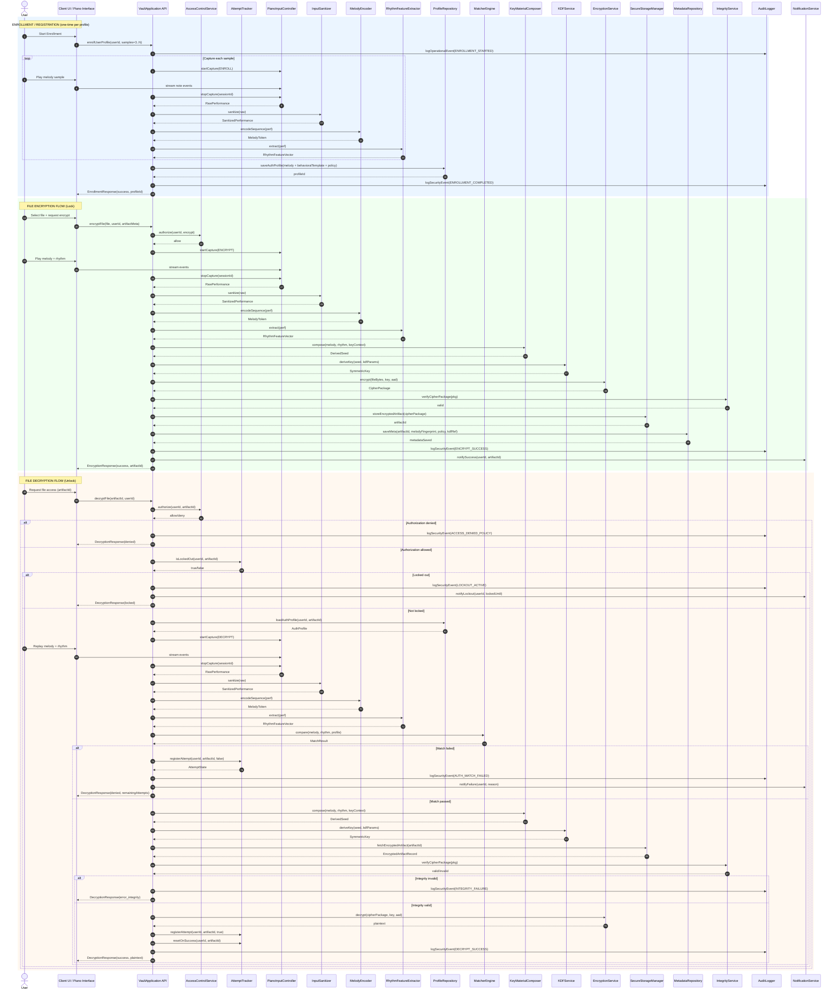
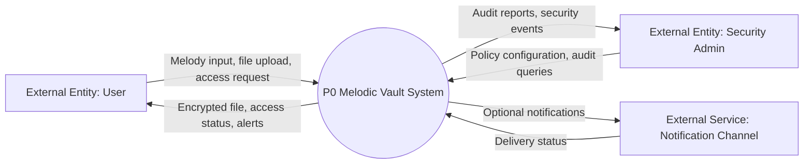
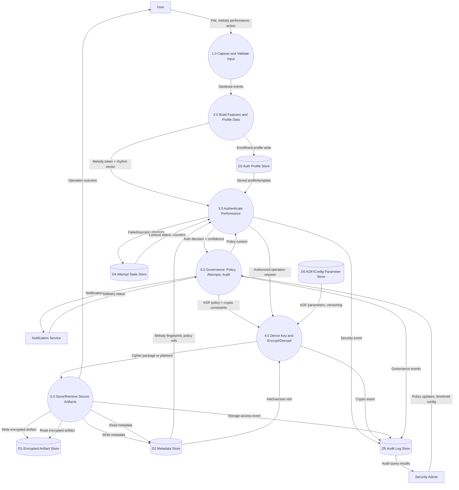
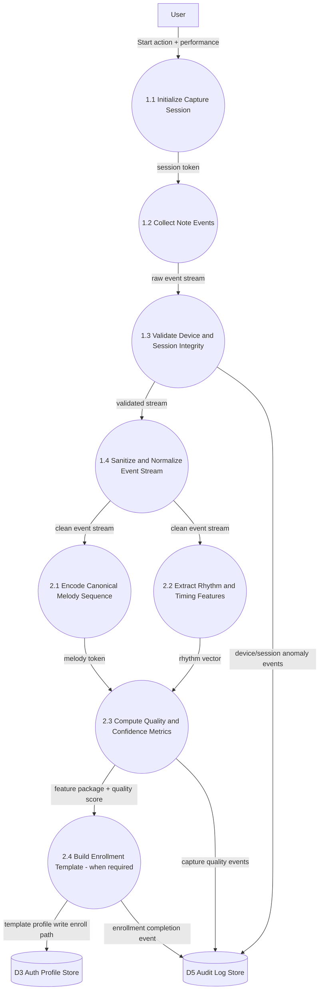
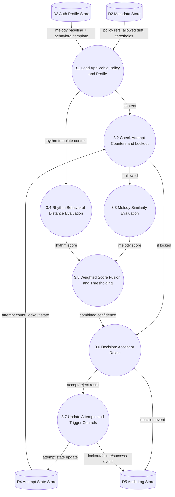
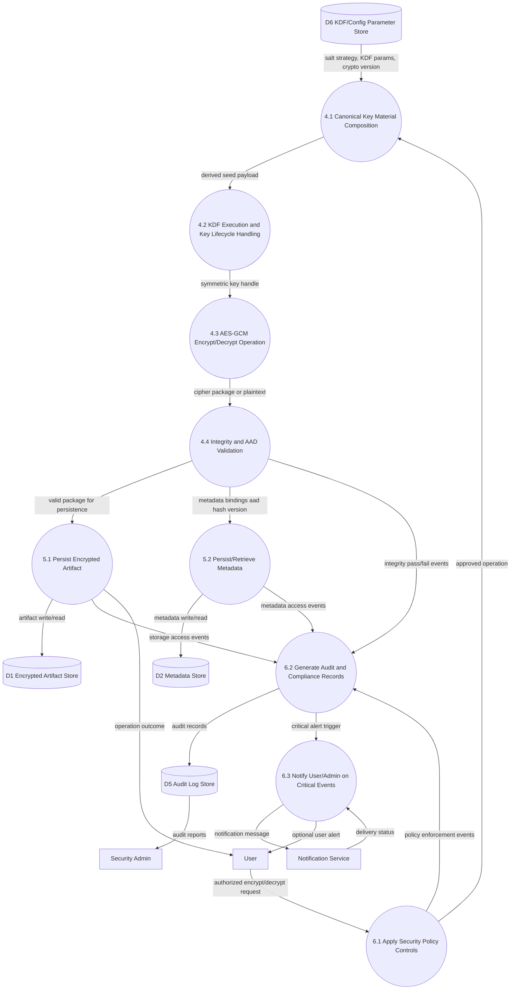

# Melodic Vault - Detailed Architecture Diagrams

## 1. Scope and Modeling Notes
This document provides three complete architecture views for Melodic Vault:
1. Class Diagram (detailed static design)
2. Sequence Diagram (end-to-end runtime behavior)
3. Data Flow Diagrams (DFD Level 0, Level 1, Level 2)

### Modeling conventions used
- Cryptography baseline: AES-256-GCM + KDF-derived key material.
- Authentication style: melody (knowledge) + rhythm dynamics (behavior).
- Security controls included: lockout, rate-limit, audit log, integrity validation.
- Storage policy: encrypted artifacts only, no plaintext file persistence.
- Timing matching: tolerance-based comparison with enrollment profile.

---

## 2. Class Diagram (Detailed)

```mermaid
classDiagram

%% =========================
%% Core Orchestration Layer
%% =========================
class VaultApplication {
  +encryptFile(request: EncryptionRequest): EncryptionResponse
  +decryptFile(request: DecryptionRequest): DecryptionResponse
  +enrollUserProfile(request: EnrollmentRequest): EnrollmentResponse
  +verifyAccess(request: AccessRequest): AccessDecision
  +validateRequest(request: BaseRequest): ValidationResult
}

class UseCaseCoordinator {
  +handleEncryptionFlow(ctx: EncryptionContext): EncryptionResult
  +handleDecryptionFlow(ctx: DecryptionContext): DecryptionResult
  +handleEnrollmentFlow(ctx: EnrollmentContext): EnrollmentResult
  +buildExecutionTrace(correlationId: String): ExecutionTrace
}

class SessionContext {
  +sessionId: String
  +userId: String
  +deviceId: String
  +correlationId: String
  +startedAt: DateTime
  +riskLevel: RiskLevel
  +isTrustedDevice(): bool
}

%% =========================
%% Input and Capture Layer
%% =========================
class PianoInputController {
  +startCapture(mode: CaptureMode): CaptureSession
  +stopCapture(sessionId: String): RawPerformance
  +validateInputDevice(deviceId: String): DeviceValidationResult
  +setInputSource(source: InputSource): void
}

class RawPerformance {
  +performanceId: String
  +capturedAt: DateTime
  +source: InputSource
  +events: List~NoteEvent~
  +durationMs: int
  +tempoEstimateBpm: float
  +isComplete: bool
}

class NoteEvent {
  +eventId: String
  +note: String
  +pitchClass: int
  +octave: int
  +velocity: int
  +pressedAtMs: long
  +releasedAtMs: long
  +holdDurationMs: long
}

class InputSanitizer {
  +sanitize(raw: RawPerformance): SanitizedPerformance
  +removeNoise(events: List~NoteEvent~): List~NoteEvent~
  +normalizeTimestamps(raw: RawPerformance): RawPerformance
}

class SanitizedPerformance {
  +performanceId: String
  +events: List~NoteEvent~
  +interOnsetIntervals: List~int~
  +holdDurations: List~int~
  +validityScore: float
}

%% =========================
%% Behavioral Biometrics
%% =========================
class RhythmFeatureExtractor {
  +extract(perf: SanitizedPerformance): RhythmFeatureVector
  +computeIOI(events: List~NoteEvent~): List~int~
  +computeTempoInvariantRatios(ioi: List~int~): List~float~
  +computeStabilityScore(features: RhythmFeatureVector): float
}

class RhythmFeatureVector {
  +vectorId: String
  +ioiRatios: List~float~
  +holdRatios: List~float~
  +timingVariance: float
  +accentProfile: List~float~
  +tempoBand: String
}

class MelodyEncoder {
  +encodeSequence(perf: SanitizedPerformance): MelodyToken
  +canonicalizeNotes(notes: List~String~): String
  +computeNGramFingerprint(encoded: String): String
}

class MelodyToken {
  +tokenId: String
  +canonicalSequence: String
  +fingerprint: String
  +noteCount: int
  +rangeSemitones: int
}

class BiometricTemplateBuilder {
  +buildTemplate(samples: List~RhythmFeatureVector~): BehavioralTemplate
  +computeMeanVector(samples: List~RhythmFeatureVector~): List~float~
  +computeCovariance(samples: List~RhythmFeatureVector~): Matrix
}

class BehavioralTemplate {
  +templateId: String
  +userId: String
  +meanVector: List~float~
  +covarianceRef: String
  +acceptanceThreshold: float
  +createdAt: DateTime
}

class MatcherEngine {
  +compare(melody: MelodyToken, rhythm: RhythmFeatureVector, profile: AuthProfile): MatchResult
  +melodyDistance(a: MelodyToken, b: MelodyToken): float
  +rhythmDistance(a: RhythmFeatureVector, t: BehavioralTemplate): float
  +combinedScore(melodyScore: float, rhythmScore: float): float
}

class MatchResult {
  +melodyScore: float
  +rhythmScore: float
  +combinedScore: float
  +accepted: bool
  +failureReason: String
}

%% =========================
%% Key Derivation and Crypto
%% =========================
class KeyMaterialComposer {
  +compose(melody: MelodyToken, rhythm: RhythmFeatureVector, context: KeyContext): DerivedSeed
  +canonicalSerialize(...): String
  +bindContext(serialized: String, ctx: KeyContext): String
}

class KeyContext {
  +fileId: String
  +userId: String
  +vaultVersion: String
  +kdfSaltRef: String
  +pepperId: String
}

class DerivedSeed {
  +seedDigest: String
  +entropyEstimate: float
  +version: String
}

class KDFService {
  +deriveKey(seed: DerivedSeed, params: KDFParameters): SymmetricKey
  +verifyParameters(params: KDFParameters): bool
}

class KDFParameters {
  +algorithm: String
  +iterations: int
  +memoryKiB: int
  +parallelism: int
  +salt: String
  +outputLength: int
}

class SymmetricKey {
  +keyId: String
  +bytesRef: SecureHandle
  +algorithm: String
  +lengthBits: int
  +destroy(): void
}

class EncryptionService {
  +encrypt(plain: BinaryBlob, key: SymmetricKey, aad: String): CipherPackage
  +decrypt(pkg: CipherPackage, key: SymmetricKey, aad: String): BinaryBlob
  +generateNonce(): String
}

class CipherPackage {
  +ciphertext: BinaryBlob
  +nonce: String
  +authTag: String
  +aadHash: String
  +cryptoVersion: String
}

%% =========================
%% Persistence and Metadata
%% =========================
class SecureStorageManager {
  +storeEncryptedArtifact(record: EncryptedArtifactRecord): String
  +fetchEncryptedArtifact(artifactId: String): EncryptedArtifactRecord
  +deleteArtifact(artifactId: String): void
}

class EncryptedArtifactRecord {
  +artifactId: String
  +ownerUserId: String
  +fileName: String
  +mimeType: String
  +cipherPackageRef: String
  +metadataRef: String
  +createdAt: DateTime
}

class MetadataRepository {
  +saveMeta(meta: VaultMetadata): String
  +getMeta(artifactId: String): VaultMetadata
  +updateAccessState(state: AccessState): void
}

class VaultMetadata {
  +artifactId: String
  +melodyFingerprint: String
  +templateRef: String
  +kdfParamRef: String
  +allowedDriftMs: int
  +maxAttempts: int
  +lockoutWindowSec: int
  +version: String
}

class ProfileRepository {
  +saveAuthProfile(profile: AuthProfile): String
  +loadAuthProfile(userId: String, artifactId: String): AuthProfile
  +rotateProfile(profileId: String): void
}

class AuthProfile {
  +profileId: String
  +userId: String
  +melodyToken: MelodyToken
  +behavioralTemplate: BehavioralTemplate
  +policy: AuthPolicy
}

class AuthPolicy {
  +maxAttempts: int
  +lockoutSeconds: int
  +minConfidence: float
  +deviceBindingRequired: bool
}

%% =========================
%% Security and Governance
%% =========================
class AccessControlService {
  +authorize(userId: String, artifactId: String): AuthorizationResult
  +checkDeviceBinding(ctx: SessionContext): bool
  +isWithinPolicy(state: AttemptState, policy: AuthPolicy): bool
}

class AttemptTracker {
  +registerAttempt(userId: String, artifactId: String, success: bool): AttemptState
  +isLockedOut(userId: String, artifactId: String): bool
  +resetOnSuccess(userId: String, artifactId: String): void
}

class AttemptState {
  +failedAttempts: int
  +lockedUntil: DateTime
  +lastAttemptAt: DateTime
}

class IntegrityService {
  +verifyCipherPackage(pkg: CipherPackage): bool
  +verifyMetadataSignature(meta: VaultMetadata): bool
  +computeDigest(blob: BinaryBlob): String
}

class AuditLogger {
  +logSecurityEvent(event: SecurityEvent): void
  +logOperationalEvent(event: OperationalEvent): void
  +queryByCorrelationId(id: String): List~AuditRecord~
}

class SecurityEvent {
  +eventType: String
  +userId: String
  +artifactId: String
  +severity: String
  +timestamp: DateTime
  +details: Map
}

class NotificationService {
  +notifyFailure(userId: String, reason: String): void
  +notifyLockout(userId: String, until: DateTime): void
  +notifySuccess(userId: String, artifactId: String): void
}

%% =========================
%% DTOs
%% =========================
class EncryptionRequest
class EncryptionResponse
class DecryptionRequest
class DecryptionResponse
class EnrollmentRequest
class EnrollmentResponse
class AccessRequest
class AccessDecision
class EncryptionContext
class DecryptionContext
class EnrollmentContext
class EncryptionResult
class DecryptionResult
class EnrollmentResult

%% =========================
%% Relationships
%% =========================
VaultApplication --> UseCaseCoordinator
VaultApplication --> AccessControlService
VaultApplication --> AuditLogger

UseCaseCoordinator --> PianoInputController
UseCaseCoordinator --> InputSanitizer
UseCaseCoordinator --> MelodyEncoder
UseCaseCoordinator --> RhythmFeatureExtractor
UseCaseCoordinator --> MatcherEngine
UseCaseCoordinator --> KeyMaterialComposer
UseCaseCoordinator --> KDFService
UseCaseCoordinator --> EncryptionService
UseCaseCoordinator --> SecureStorageManager
UseCaseCoordinator --> MetadataRepository
UseCaseCoordinator --> ProfileRepository
UseCaseCoordinator --> AttemptTracker
UseCaseCoordinator --> IntegrityService
UseCaseCoordinator --> NotificationService

PianoInputController --> RawPerformance
RawPerformance --> NoteEvent
InputSanitizer --> SanitizedPerformance
RhythmFeatureExtractor --> RhythmFeatureVector
MelodyEncoder --> MelodyToken
BiometricTemplateBuilder --> BehavioralTemplate
MatcherEngine --> MatchResult

KeyMaterialComposer --> DerivedSeed
KeyMaterialComposer --> KeyContext
KDFService --> KDFParameters
KDFService --> SymmetricKey
EncryptionService --> CipherPackage

SecureStorageManager --> EncryptedArtifactRecord
MetadataRepository --> VaultMetadata
ProfileRepository --> AuthProfile
AuthProfile --> MelodyToken
AuthProfile --> BehavioralTemplate
AuthProfile --> AuthPolicy

AttemptTracker --> AttemptState
AuditLogger --> SecurityEvent

EncryptionRequest ..> EncryptionContext
DecryptionRequest ..> DecryptionContext
EnrollmentRequest ..> EnrollmentContext
```

---

## 3. Sequence Diagram (Detailed End-to-End)

---

## 4. DFD Level 0 (Context Diagram)

### Level 0 explanation
- Entire platform modeled as one process: P0 Melodic Vault System.
- User and Security Admin are external entities.
- Data stores are intentionally omitted at Level 0 context view (industry DFD convention).

---

## 5. DFD Level 1 (Major Process Decomposition)

### Level 1 explanation
- Process 1.0 handles raw capture and basic validation.
- Process 2.0 transforms input into melody/rhythm features and enrollment profile data.
- Process 3.0 authenticates with tolerance and lockout awareness.
- Process 4.0 handles deterministic key derivation and AES operations.
- Process 5.0 isolates persistence of encrypted artifact + metadata.
- Process 6.0 centralizes policy, attempts, lockout, audit, notifications.

---

## 6. DFD Level 2 (Detailed Decomposition)

Level 2 is shown in three detailed sub-diagrams covering the most critical Level 1 processes.

### 6.1 DFD Level 2 for Process 1.0 + 2.0 (Capture, Sanitize, Feature Build)

### 6.2 DFD Level 2 for Process 3.0 (Authentication and Decisioning)

### 6.3 DFD Level 2 for Process 4.0 + 5.0 + 6.0 (Key Derivation, Crypto, Storage, Governance)

---

## 7. Industry-Standard Coverage Checklist

The diagrams explicitly cover:
- Enrollment lifecycle for behavioral template creation.
- Encryption and decryption lifecycle, including decision branches.
- Separation of concerns: capture, feature extraction, auth, crypto, storage, governance.
- Key derivation path with configuration store and deterministic composition.
- Data stores segmented by artifact, metadata, profile, attempts, audit, and KDF config.
- Security controls: lockout, policy gates, integrity verification, audit logging, notification.
- Failure handling branches (auth fail, lockout active, integrity fail, policy denial).

## 8. Suggested Usage
- Use Class Diagram for implementation planning and object design.
- Use Sequence Diagram for API orchestration and testing scenarios.
- Use DFD Levels 0/1/2 for thesis/report/system-design sections, threat modeling, and compliance discussion.
